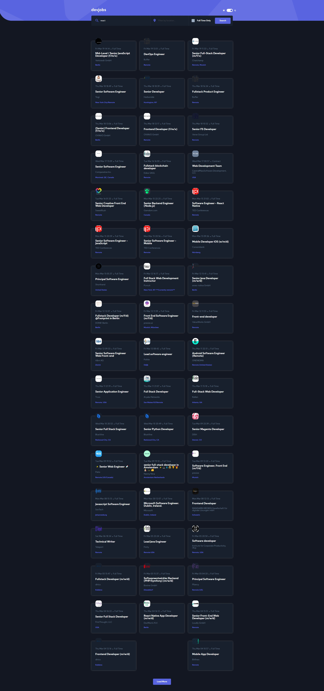

# Frontend Mentor - GitHub Jobs API solution

This is a solution to the [GitHub Jobs API challenge on Frontend Mentor](https://www.frontendmentor.io/challenges/github-jobs-api-93L-NL6rP). Frontend Mentor challenges help you improve your coding skills by building realistic projects.

My solution is identical compare to the intitial design ✔

## Table of contents

- [Overview](#overview)
  - [The challenge](#the-challenge)
  - [Screenshot](#screenshot)
  - [Links](#links)
- [My process](#my-process)
  - [Built with](#built-with)
  - [What I learned](#what-i-learned)
  - [Continued development](#continued-development)
  - [Useful resources](#useful-resources)
- [Author](#author)
- [Acknowledgments](#acknowledgments)

## Overview

### The challenge

Users should be able to:

- View the optimal layout for each page depending on their device's screen size ✔
- See hover states for all interactive elements throughout the site ✔
- View all jobs currently live on the GitHub Jobs API ✔
- Be able to click a job from the index page so that they can read more information and apply for the job ✔
- **Bonus**: Have the correct color scheme chosen for them based on their computer preferences. _Hint_: Research `prefers-color-scheme` in CSS. ✔

### Screenshot

### Links

- Solution URL: [https://www.frontendmentor.io/solutions/github-jobs-api-html-css-js-vanilla-jUGLCknf3](https://www.frontendmentor.io/solutions/github-jobs-api-html-css-js-vanilla-jUGLCknf3)
- Live Site URL: [https://baradelclement-github-jobs.surge.sh/](https://baradelclement-github-jobs.surge.sh/)

## My process

### Built with

- Semantic HTML5 markup
- SCSS
- Flexbox
- Mobile-first workflow
- JS Vanilla
- Proxy with Heroku

### What I learned

* Fetch data from API and consume it
* Handle CORS Errors
* Build proxy to avoid CORS errors.

## Author

- Website - SOON
- Frontend Mentor - [@Koyazh](https://www.frontendmentor.io/profile/Koyazh)
- Linkedin - [BaradelClément](https://www.linkedin.com/in/cl%C3%A9ment-baradel-330460209)
